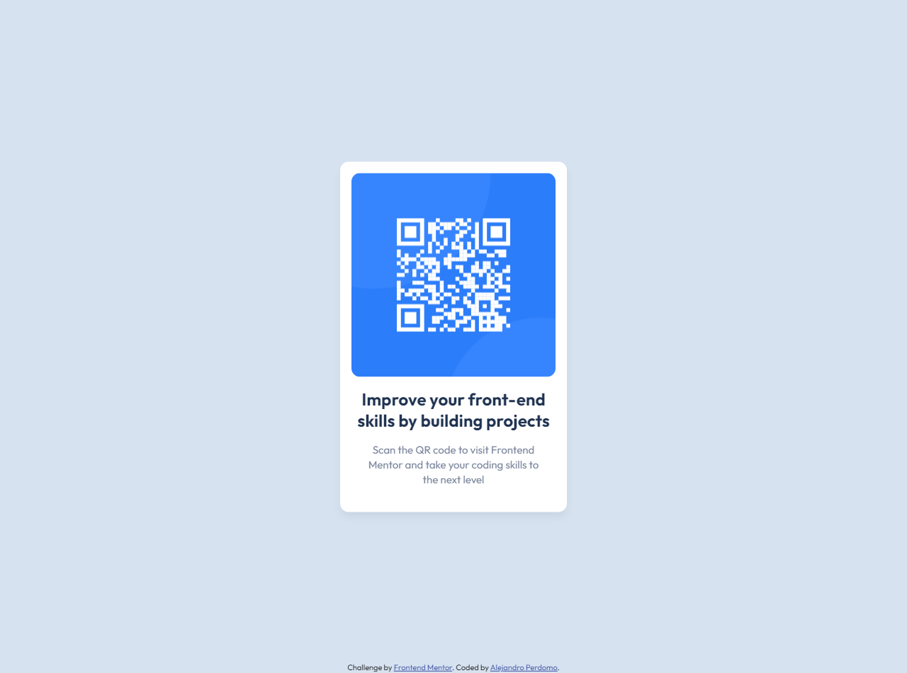

# Frontend Mentor - QR code component solution

This is a solution to the [QR code component challenge on Frontend Mentor](https://www.frontendmentor.io/challenges/qr-code-component-iux_sIO_H). Frontend Mentor challenges help you improve your coding skills by building realistic projects.

## Table of contents

- [Overview](#overview)
  - [Screenshot](#screenshot)
  - [Links](#links)
- [My process](#my-process)
  - [Built with](#built-with)
  - [What I learned](#what-i-learned)
  - [Continued development](#continued-development)
- [Author](#author)

## Overview

This is a component that shows an image of a QR code alongside a short description that tells the user where the QR codes leads to. This component is made using just HTML and CSS.

### Screenshot



### Links

- Solution URL: [Add solution URL here](https://your-solution-url.com)
- Live Site URL: [QR Code Alejandro](https://qr-code-alejandro.netlify.app)

## My process

First I decided to deeply inspect the design previews from the starter files. Then I proceeded to add and organize the missing content to the HTML code, alongside adding some CSS classes format the content. Then in the CSS file I started by globally resetting the padding and margin values, and also changed the box-sizing to border-box. Then I changed the font-size in the HTML so I can easily use rem for a responsive design in mobile view, and also applied the font family in the body element. I used a container class to vertically and horizontally align the QR Code box in the view using position = fixed. Then I decided to use flexbox to style the QR Code box and used the gap property to separate the image and the text elements, and applied some border-radius to the box and the image itself. Then I styled the text elements using the colors provided by the started files, and also changed the line-height in both text elements to make them closer to the original design. Finally I used position = fixed on the attribution text to place it at the bottom of the page. My IDE of choice is VS Code.

### Built with

- Semantic HTML5 markup
- CSS custom properties
- Flexbox
- Desktop-first workflow

### What I learned

This project helped me reinforce some aspects of CSS that I've been learning for a little while like how to center boxes and content using classes and the position property just like in the snippet below:

```css
.align-center {
  position: fixed;
  top: 50%;
  left: 50%;
  transform: translate(-50%, -50%);
}
```

### Continued development

I want to continue learning and practicing HTML and specially CSS and eventually JS using the challenges that frontend mentor provides to take my skills to the next level.

## Author

- Frontend Mentor - [@Cavalry2010](https://www.frontendmentor.io/profile/yourusername)
- Twitter - [@AlPerdomoMC](https://www.twitter.com/AlPerdomoMC)
